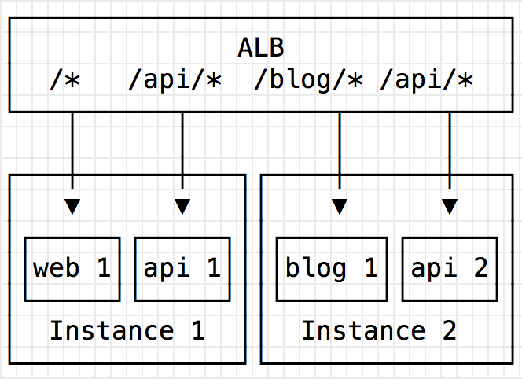
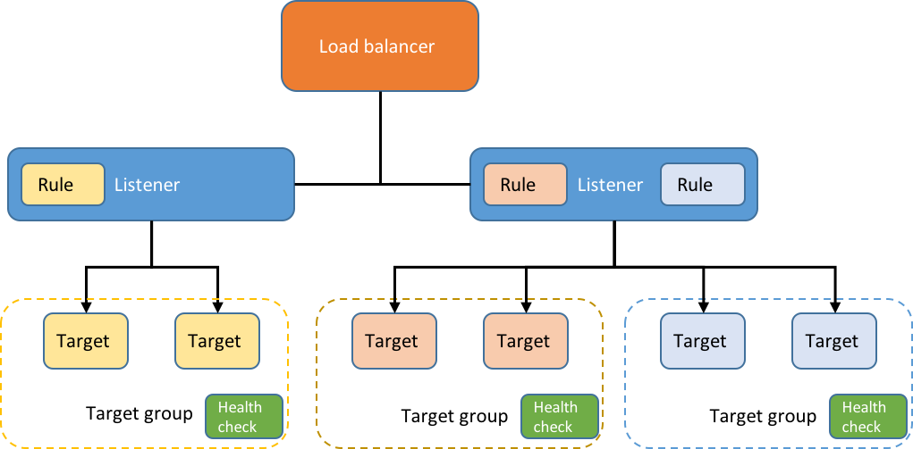

# Microservices on ECS POC

This POC launches ECS services fronted by Application Load Balancer that registers dynamic host ports and routes like an API Gateway.
Containers can find each other at <ALB_ENDPOINT>/api, which is where the health check lies-- No service discovery required.
It is also packaged with an EFS /mnt for persistent storage in each container, and creates log groups for each ECS service, as well as the ecs-agents which are easily filtered in CloudWatch Logs.

The POC uses the latest CoreOS Stable AMIs.

To run, configure your AWS provider as described in https://www.terraform.io/docs/providers/aws/index.html
(or, just copy terraform.tfvars.editme to terraform.tfvars and add your IAM user for administering AWS )

## Architecture


* Public net only for now

Source: https://github.com/awslabs/ecs-refarch-cloudformation


### ALB
The generated ALB Endpoint is set as an environment variable in each container, $ENDPOINT


Source: https://convox.com/blog/alb/

Health check are done via target groups for each container:


Source: https://aws.amazon.com/blogs/compute/microservice-delivery-with-amazon-ecs-and-application-load-balancers/

As pictured, they can all share a listener.  The health check looks for /target.


### EFS
`[Container's /mnt] >> [ EFS_mnt/container_name ]` #bestartwork

### Microservices
Examples stolen from: https://github.com/awslabs/ecs-refarch-cloudformation/tree/master/services.  
Product web (2 containers) talks to a product api (2 containers) for products listing.  4 containers total running on only two ECS instances.

## Get up and running

**Planning phase**

Run this first for syntax or logic check!

```
terraform plan \
	-var admin_cidr_ingress="0.0.0.0/0" \
	-var key_name=dummykey
```

**Apply phase**

Please use your existing aws key-pair key you have access to in place of *your_key_name*.  This will be the key you use to log into instances

```
ip=$(curl -s https://4.ifcfg.me/) && \
terraform apply \
	-var admin_cidr_ingress="${ip}/32" \
	-var key_name={your_key_name}
```

Once the stack is created, **wait for a few minutes** for the positive health checks and test the stack by launching a browser with the ALB url.
- First service listed in container_name var will be available at / (i.e. product-web)
- Each subsequent service will be available at /container_name (i.e. /products)

## Destroy :boom:

```
terraform destroy \
    -var admin_cidr_ingress='"0.0.0.0/0"' \
    -var key_name=dummykey
```
